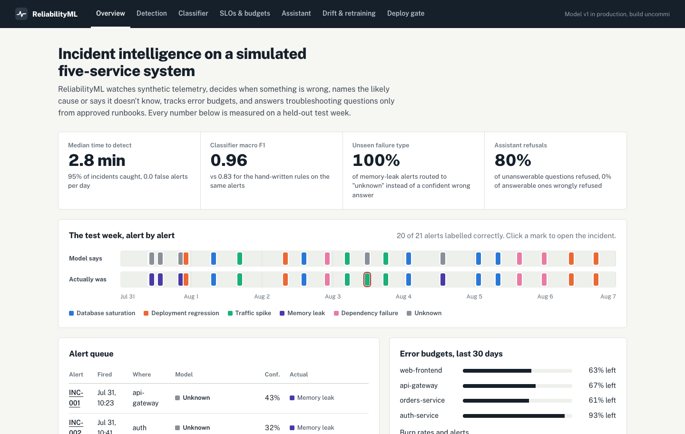
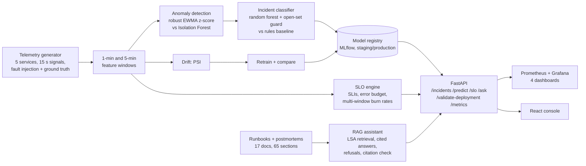
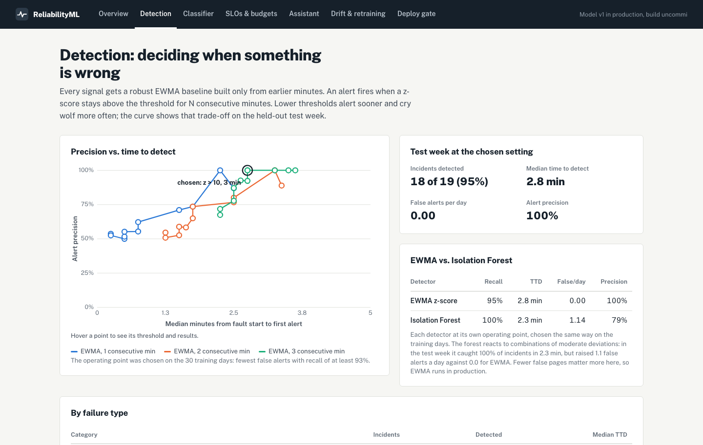
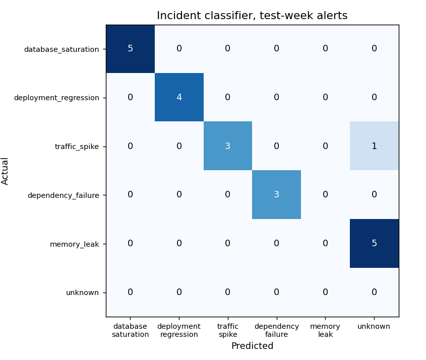
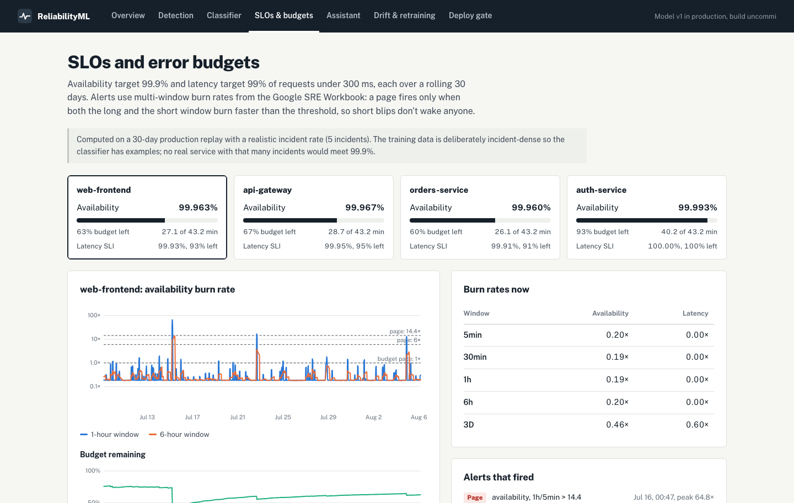
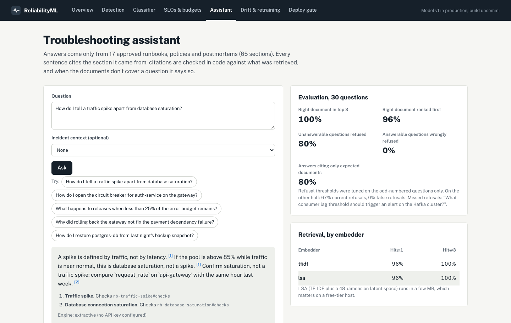
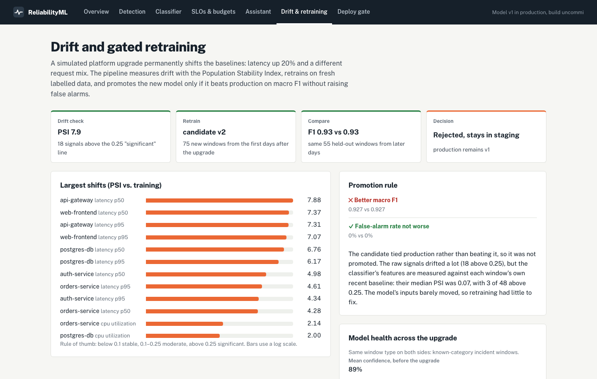
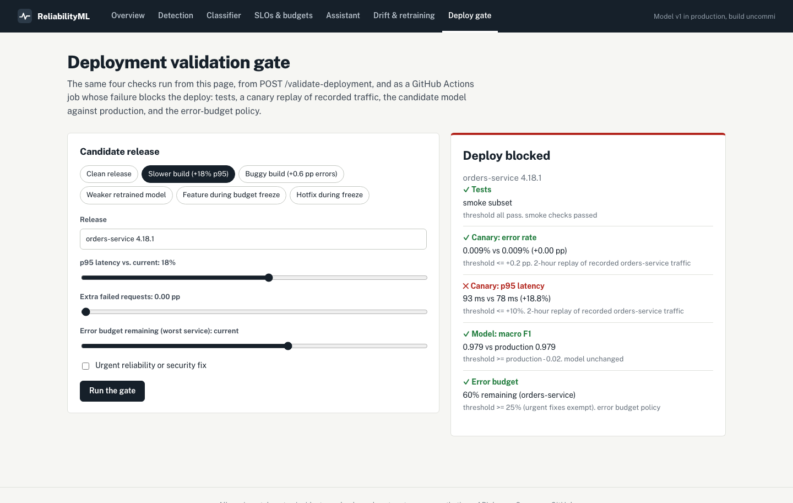

# ReliabilityML

**Incident intelligence and MLOps on simulated telemetry.** ReliabilityML ingests logs, metrics, traces
and deploy events from a simulated five-service system, detects incidents, names the probable cause (or
says it doesn't know), tracks SLOs and error budgets, answers troubleshooting questions from approved
runbooks with citations, and gates deploys and model promotions on measured evidence.

> **Data:** all services, telemetry, incidents, runbooks and postmortems are synthetic. The system is not
> connected to any real production environment. The results show the method, not real-world accuracy.



## Results (held-out test week, different random seed from training)

| Area | Result | Baseline / context |
| --- | --- | --- |
| Detection | **2.8 min** median time to detect, **95%** of incidents caught (18/19), **0** false alerts per day | Isolation Forest: 100% recall, 2.3 min, 1.1 false alerts/day |
| Classification | **0.96** macro F1 on real alerts (0.98 on incident windows) | Hand-written rules from the runbooks: 0.83 (0.74) |
| Unseen failure type | **5 of 5** memory-leak alerts routed to `unknown` (held out of training) | Rules: 1 of 5 labelled correctly, 2 routed to unknown |
| SLOs | 99.9% availability SLO, **60–93%** of error budget left across services | Multi-window burn-rate alerts: 16 fired over 30 days, all during incidents |
| RAG assistant | **100%** right document in top 3, **80%** correct refusals, **0%** false refusals (30 questions) | Manual check: 21 of 25 answers fully answer the question |
| Drift | PSI **7.9** after a platform upgrade; retrained candidate **rejected** (tied, not better) | Features are baseline-relative: median feature PSI 0.07 |
| Deploy gate | Blocks slower, buggier and weaker-model releases and features during a budget freeze | Urgent fixes exempt from the freeze |

Every number is written by the pipeline to `artifacts/summary.json`; nothing above is typed by hand. Figures are
from the reference run (macOS, Python 3.10, scikit-learn 1.7). Seeds make runs repeatable on one platform, but
other library versions can move results in the second decimal place: the Linux CI run measured 0.973
window-level macro F1 against 0.979 here.
Honest weak spots are called out where they appear, and in [Limitations](#limitations).

## How it works



### 1. Synthetic telemetry (the foundation)

`web-frontend → api-gateway → orders-service → postgres-db`, plus `api-gateway → auth-service`. Every 15
seconds each service emits request rate (daily and weekly seasonality), p50/p95/p99 latency (log-normal),
error rate, CPU, memory, database connections, log counts by level and span durations. Five fault types are
injected with start, end, service and category recorded as ground truth. Latency, errors and load propagate
through the call graph, which is what makes categories overlap: database saturation raises upstream errors,
a traffic spike raises latency and connections like saturation, and a dependency failure can land next to an
unrelated deploy. Short noise spikes and mostly-clean deploys (88% of deploys cause nothing) mean
neither "something moved" nor "a deploy happened" is a free label. Seeds make every run reproducible.

| Dataset | Days | Seed | Incidents | Used for |
| --- | --- | --- | --- | --- |
| Train | 30 | 7 | 61 (no memory leaks) | detector thresholds, classifier training and validation |
| Test | 7 | 99 | 19 (3 memory leaks) | every reported result |
| Production replay | 30 | 404 | 5 | SLOs, error budgets, the live metrics replay |
| Post-upgrade | 10 | 303 | 26 | drift detection and the retraining cycle |

The training data is deliberately incident-dense (about 2.6 incidents a day) so the classifier has examples.
A real service with that many incidents could never meet 99.9%, so SLOs are computed on a separate replay with
a realistic incident rate.

### 2. Detection: when is something wrong?

Each signal gets a robust EWMA baseline built only from earlier minutes. A new value is clipped to mean ± 4σ
before it updates the baseline, so an incident cannot inflate its own baseline and hide its second minute (the
naive version missed large error spikes for exactly that reason). An alert fires when the largest z-score stays
above a threshold for N consecutive minutes.



The operating point (z > 10 for 3 minutes) was chosen on the training days: fewest false alerts with recall of at
least 93%. Memory leaks are the honest weak spot. A slow climb looks normal to an adapting baseline, so they are
caught only when containers restart, hours in.

### 3. Classification: what is wrong?

Features per alert window: deltas vs a baseline that ends 10 minutes before the alert, for latency, errors, CPU,
memory and traffic on every service; database pool saturation; minutes since the last deploy on the error origin,
its dependencies and anywhere; how many services have errors and how deep in the call chain; ERROR log volume;
and which span added the most latency. All features at time *t* use only data up to *t* (tested).

- **Rules baseline:** if/then rules written from the runbooks, including a memory-leak rule. This is the honest control.
- **Models:** random forest and gradient boosting; chosen on a time-based validation split (days 22–30).
- **Unknown handling:** two guards, both tuned on validation data. A confidence cut-off, chosen so that harmless
  noise alerts fall into `unknown`, and a novelty guard that rejects windows far from every training example
  (nearest-neighbour distance beyond the 99th percentile). Confidence alone was not enough: without the novelty
  guard the forest labelled most memory-leak windows as traffic spikes, confidently.



Every run is tracked in MLflow with parameters (model type, hyperparameters, feature-set version, data seeds),
metrics, the confusion matrix, feature importance, the model file, and tags for the git commit and dataset
version. Promotion uses registry aliases `staging` and `production` (the successor to MLflow's deprecated
stages); the API serves the version holding `production`.

### 4. SLOs and error budgets

Availability (99.9%) and latency (99% of requests under 300 ms, estimated from a log-normal fitted to each
minute's p50 and p95), each over a rolling 30 days. 99.9% allows 43.2 minutes of full downtime. Burn rate =
observed error rate ÷ allowed error rate. Alerts follow the Google SRE Workbook's multi-window rules and fire
only when both windows exceed the threshold:

| Severity | Long / short window | Burn rate | Budget spent if sustained |
| --- | --- | --- | --- |
| Page | 1 h / 5 min | 14.4 | 2% in 1 hour |
| Page | 6 h / 30 min | 6 | 5% in 6 hours |
| Ticket | 3 days / 6 h | 1 | 10% in 3 days |



### 5. Troubleshooting assistant (RAG)

17 synthetic documents (6 runbooks, 8 postmortems, 3 policies) with metadata, split by section heading with a
one-sentence overlap into 65 chunks. Retrieval uses LSA (TF-IDF plus a 48-dimension latent space), chosen over
plain TF-IDF on the evaluation set; it runs in a few MB, which matters on a free host. `sentence-transformers` is
an optional embedder behind the same interface.

Answer rules are enforced in the prompt **and in code**: every sentence must cite a retrieved chunk ID, any
citation outside the retrieved set rejects the whole answer, and weak evidence returns *"I couldn't find this in
the approved runbooks or postmortems."* With an Anthropic API key the assistant composes answers with Claude
using versioned prompts (`src/reliabilityml/rag/prompts/`); without one, an extractive engine quotes the best
supporting sentences.



Evaluation: 30 questions (25 answerable, 5 that must be refused). Refusal thresholds were tuned on the
odd-numbered questions only and reported on both halves. Results are logged to MLflow per engine and prompt
version. A manual spot-check is in [eval/reports/manual_spot_check.md](eval/reports/manual_spot_check.md): 21 of
25 answers fully answer the question, and the one missed refusal is a Kafka question answered from a generic
triage section.

### 6. Drift and gated retraining

A simulated platform upgrade shifts baselines permanently (latency +20%, a different request mix). The Population
Stability Index flags 18 raw signals as significantly shifted (max 7.9). The pipeline retrains on fresh labelled
windows, compares the candidate with production on the same later held-out windows, and promotes only if macro F1
is better **and** the false-alarm rate is not worse. In this run the candidate tied (0.927 vs 0.927), so it stayed
in staging. The reason is measurable: the classifier's features are relative to each window's own baseline, and
their median PSI across the upgrade was 0.07.



### 7. Deployment validation gate

`POST /validate-deployment`, the console and a GitHub Actions job run the same checks: tests; a canary replay of
recorded traffic (error rate may rise at most 0.2 pp, p95 latency at most 10%); the candidate model no worse than
production (tolerance 0.02 macro F1); and the error-budget policy (below 25% remaining, only urgent fixes ship).
In CI a failing gate blocks the deploy job, and CI also asserts that a deliberately slow release is blocked.



## API

| Endpoint | Method | Purpose |
| --- | --- | --- |
| `/health` | GET | Liveness, model version, commit |
| `/metrics` | GET | Prometheus: API latency and errors, replayed service metrics, burn rates, budgets, model health |
| `/incidents` | GET | Detected incidents with prediction, confidence and ground truth |
| `/incidents/{id}` | GET | Evidence, probabilities, unknown reason, signals, trace, logs, deploys |
| `/predict` | POST | Classify a feature window (or re-run an incident) |
| `/slo/{service}` | GET | SLIs, remaining budget, burn rates per window, alerts |
| `/ask` | POST | RAG assistant (question plus optional incident ID) |
| `/validate-deployment` | POST | Run the deployment gate |

Interactive docs at `/docs`. The API instruments itself with OpenTelemetry when `OTEL_EXPORTER_OTLP_ENDPOINT` is
set (docker-compose sends traces to Jaeger), so the platform monitors its own reliability.

## Run it

Prerequisites: Python 3.10+ and Node.js 22.12+.

```bash
python -m venv .venv && .venv/bin/pip install -e '.[dev,mlops]'
.venv/bin/python -m reliabilityml.pipelines.build     # ~1 min: data, models, reports -> artifacts/
cd frontend && npm install && npm run build && cd ..
.venv/bin/uvicorn reliabilityml.api.main:app          # http://127.0.0.1:8000
```

Full local stack (API and console, Prometheus, Grafana with four provisioned dashboards, Jaeger, MLflow):

```bash
docker compose up --build
# console :8000   grafana :3000   prometheus :9090   jaeger :16686   mlflow :5000
```

Tests: `.venv/bin/pytest` (28 tests, 90% coverage, including a full pipeline run) and `cd frontend && npm test`.
Covered: burn-rate and PSI maths against hand calculations, seed determinism, faults appearing in ground truth,
no future leakage in baselines or features, known faults detected within the expected time, deterministic
predictions, refusals and citation checks, contract tests for every endpoint, and the gate blocking bad candidates.

## Deployment

- **Live demo:** a free Render web service built from the Dockerfile. The image runs the pipeline at build time
  (deterministic seeds) and serves the result, with no MLflow or training dependencies at runtime.
- **GCP design (v3):** [infra/terraform](infra/terraform) defines Cloud Run (API, scale to zero), a Cloud Run job
  for the daily drift check triggered by Cloud Scheduler, Pub/Sub with a BigQuery subscription for telemetry,
  BigQuery tables, a Cloud Storage bucket for artifacts (the API and pipeline sync through it), Secret Manager for
  the API key, service accounts, and a billing budget alert created first. It passes `terraform validate` in CI.
  It has not been applied: running it needs a GCP project and billing.
- **Why Cloud Run over GKE:** much cheaper and simpler for a stateless API that idles most of the day. GKE was
  considered; [infra/k8s](infra/k8s) has a Deployment, Service and HPA for a local kind or minikube cluster.
- **CI/CD:** GitHub Actions runs lint, format, type checks, tests, the gate, Terraform validation and a Docker
  smoke test on every push. The deploy workflow runs only after CI passes on `main`, and deploys only if the gate
  passes.

## Limitations

- **Synthetic data.** The generator was written by the same person who wrote the detector and classifier, so the
  scores are optimistic. Real telemetry has missing data, clock skew, many more services and labels that come from
  imperfect postmortems.
- **Small test set.** 19 test incidents means each per-class number rests on 2–5 incidents. The window-level
  evaluation (five windows per incident) is more stable but not independent.
- **Memory leaks are detected late** (at container restarts). A trend detector on memory would fix that.
- **The extractive assistant selects sentences but cannot synthesize.** 4 of 25 answers were relevant but did not
  answer the question. The Claude engine is implemented but not part of the reported numbers.
- **One drift scenario.** The classifier was robust to a baseline shift; a change in failure *behaviour* (a new
  way for the database to fail, say) would need new labels, not just retraining.

## Next steps

Label real incidents from postmortems; per-service baselines and seasonality-aware detection; a memory trend
detector; human feedback on predictions feeding the training set; evaluating the Claude engine per prompt version
on the same questions; applying the Terraform to a sandbox project behind the budget alert.

## Repository

```text
src/reliabilityml/
  generator/     simulated services, fault injection, ground truth
  features/      minute rollups, robust EWMA baselines
  detection/     EWMA and Isolation Forest detectors, detection metrics
  classifier/    features, rules baseline, model with open-set guard, registry (MLflow)
  slo/           SLIs, error budgets, burn-rate alerts
  rag/           corpus chunking, embeddings, vector store, assistant, prompts, evaluation
  drift/         PSI and the gated retraining cycle
  gate/          deployment validation gate (API and CLI)
  pipelines/     end-to-end build, Prefect flows
  api/           FastAPI app, Prometheus metrics, OpenTelemetry
corpus/          synthetic runbooks, postmortems and policies (Markdown with metadata)
eval/            RAG questions and reports
dashboards/      Prometheus config and alert rules, Grafana dashboards
infra/           Terraform (GCP) and Kubernetes manifests
frontend/        React + TypeScript console
tests/           pytest suite
```
